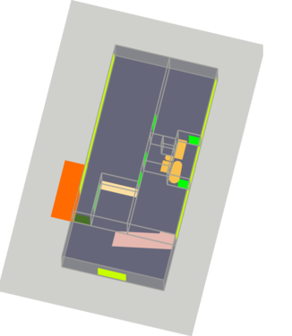
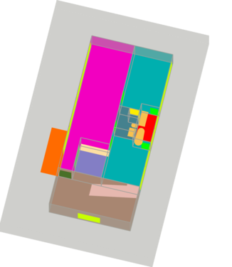

  
### [SFS-A68: A dataset for the segmentation of space functions in apartment buildings](https://doi.org/10.7146/aul.455.c222)
  

### 1. Introduction:

Analyzing building models for quantity takeoff, building safety, or energy analysis requires function classification data of spaces and related objects. Automated space function classification is desirable to reduce input model preparation effort and errors. This study addresses a gap in existing space function classification work, which is a lack of datasets to train and evaluate machine learning and deep learning models. We present the [SFS-A68 dataset](https://zenodo.org/record/6426871) for space function segmentation in apartment buildings. The dataset consists of input and ground truth images for 68 floor plans of apartment buildings designed or built between 1952 and 2019. 

<table align="center">
  <tr>
     <td>Input Image</td>
     <td>Ground Truth</td>
  </tr>
  <tr>
    <td></td>
    <td></td>
  </tr>
 </table>

Each pixel in a ground truth image is assigned to a space function class. Space function classes in apartment buildings that are classified by the space function segmentation network are shown in Table below, right column.  We have identified **22 space function classes** for the apartment buildings in our dataset. Each layout element in an input image is colored according to a unique class color (Table below, left column). Space element classes may be helpful as metadata to determine space function classes. The defined class hierarchy of the dataset with the unique RGB color code  of each class can be seen below.

<table border="0" align="center"  width="50" >
 <tr>
    <td><b style="font-size:30px">Layout element classes</b></td>
    <td><b style="font-size:30px">Space function classes</b></td>
 </tr>
 <tr >
  <td>
   <pre ><code class="lang-txt" >
    [root]
    ├── [Space]
    │   ├── (102,102,122)[InternalSpace]
    │   └── (161,162,155)[ExternalSpace]
    └── [SpaceElement]
        ├── [SpaceContainedElement]
        │   ├── [CirculationElement]
        │   │   ├── (230, 184, 175)[FlightOfStairs]
        │   │   └── (102, 1, 30)[Landing]
        │   ├── [FurnishingElement]
        │   │   ├── (253, 223, 162)[KitchenElement]
        │   │   └── (248, 193, 79)[SanitaryElemen]
        │   └── [EquipmentElement]
        │       └── [HomeAppliance]
        │           └── (159, 140, 81)[TextileCareAppliance]
        └── [SpaceEnclosingElement]
            ├── (109, 189, 110)[Opening]
            ├── (255, 107, 0)[Partition]
            ├── (200, 255, 0)[Window]
            └── [Door]
                ├── (0, 255, 0)[RegularDoor]
                ├── (72, 112, 39)[UnitDoor]
                └── (187, 244, 154)[ElevatorDoor]
      </code></pre>
    </td>
    <td>
     <pre><code class="lang-txt" width="50">
     [Space]
     ├── [ResidentialSpace]
     │   ├── [CommunalSpace]
     │   │   ├── (107,74,101)[DiningRoom]
     │   │   ├── (166, 206, 227)[FamilyRoom]
     │   │   └── (242, 0, 192)[LivingRoom]
     │   └── [PrivateSpace]
     │       ├── (0, 255, 248)[Bedroom]
     │       │   ├── (0,175,175)[MasterBedroom]
     │       │   └── (4,72,148)[BoxRoom]
     │       └── (194, 123, 160)[HomeOffice]
     ├── [ServiceSpace]
     │   ├── (253, 237, 0)[Shaft]
     │   ├── (255, 182, 0)[StorageRoom]
     │   │   └── (191, 144, 0)[WalkInCloset]
     │   └── [SanitarySpace]
     │       ├── (255, 0, 0)[Bathroom]
     │       ├── (69, 129, 142)[Toilet]
     │       ├── (131, 126, 197)[Kitchen]
     │       └── (0, 0, 255)[LaundryRoom]
     ├── [CirculationSpace]
     │   ├── [VerticalCirculationSpace]
     │   │   ├── (9, 244, 156)[Elevator]
     │   │   └── (168, 134, 113)[Stairway]
     │   └── [HorizontalCirculationSpace]
     │       ├── (151, 143, 141)[Entrance]
     │       └── (125, 62, 32)[Hallway]
     │           ├── (225, 138, 96)[MainHallway]
     │           └── (155, 94, 65)[InternalHallway]
     └── [ExternalSpace]
         ├── (255, 255, 22)[AccessBalcony]
         └── (120, 56, 145)[Loggia]
   </code></pre>
  </td>
 </tr>
</table>

### 2. Prerequisites
In order to use the helper codes, create the environment from the environment.yml file  

        conda env create -f environment.yml

Activate the new environment: 

        conda activate SFS-A68
        
Verify that the new environment was installed correctly

        conda env list
        
### 3. Dataset and Processing:

We first used the dataset to develop two segmentation models based on [transfer learning](https://github.com/A2Amir/SFS-A68/blob/main/VGG16%20U-Net%20(Transfer%20Learning).ipynb) and [training from scratch](https://github.com/A2Amir/SFS-A68/blob/main/Training%20U-Net%20From%20Scratch.ipynb) then, the outputs of the space function segmentation models for the test dataset are evaluated by Intersection over Union (IoU) and Total Error metrics. 

